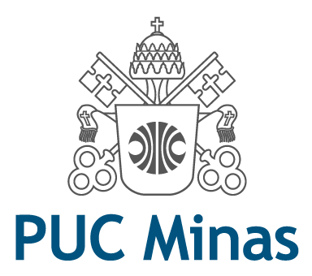

<h1 align="center">
    
</h1>

<h3 align="center">
  Laboratório de Desenvolvimento de Software - Projeto 4 - Sistema de Moeda Estudantil
</h3>

Workspace do quarto modulo, da disciplina de Laboratório de Desenvolvimento De Software 

  

  	
	

 

**Atividade:** Laboratório 4

**Grupo:** 8

**Alunos:**
- Arthur Bicalho
- Érika Márcia
- Guilherme Júlio
- Ítalo Lelis

---

## :card_index_dividers: Índice de diretórios

- [Diagramas UML](project/)
- [Código Implementado](implementation/)

## :memo: Licença

Esse projeto está sob a licença MIT. Veja o arquivo [LICENSE](LICENSE) para mais detalhes.
